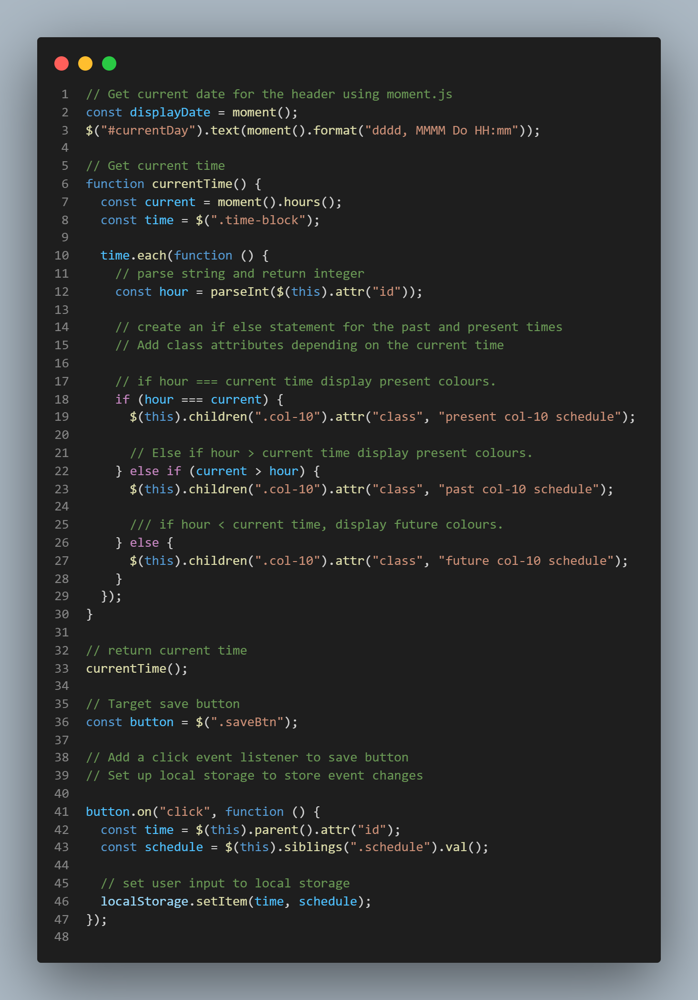

# Day-By-Day-Calendar

## Overview

For this project my aim was to create a simple calender that allows a user to save events for each of the day.

Deployed Link: https://asmaamusse.github.io/day-by-day-calendar/

GitHub page:

### What did i do?

- I used moment.js to get current times and date
- I set colours to the time blocks depending depending whether they are in the past, present or future.
- Add an on click function to the save button so to store user information in local storage.

### Technologies used:

- HTML
- CSS
- JavaScript
- jQuery

## Screenshots:

JS Code

