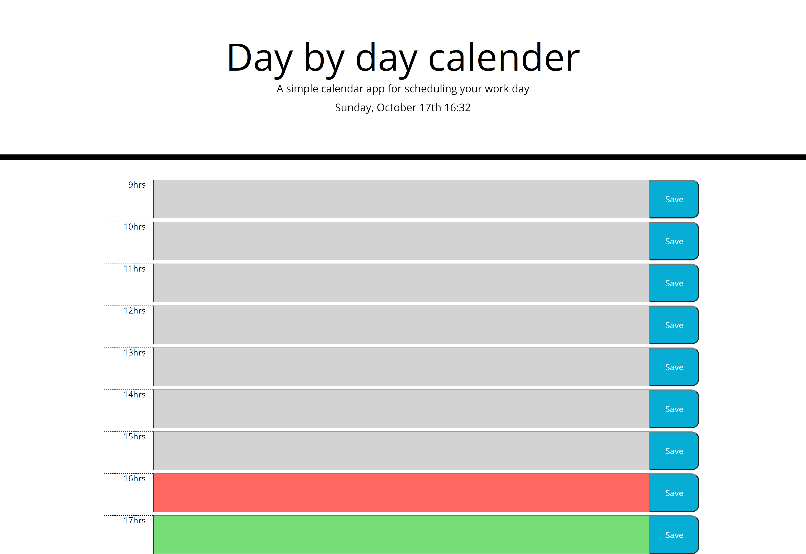

# Day By Day Calendar 

## Overview

For this project my aim was to create a simple calender that allows a user to save events for each of the day.

## Table of contents:
- [Links](#links)
- [Technologies Used](#technologies-used)
- [Screenshots](#screenshots)
- [Contribute](#contribute)

## Links:
Deployed Link: https://asmaamusse.github.io/day-by-day-calendar/

GitHub page:https://github.com/AsmaaMusse/day-by-day-calendar

### What did i do?

- I used moment.js to get current times and date
- I set colours to the time blocks depending depending whether they are in the past, present or future.
- Add an on click function to the save button so to store user information in local storage.

### Technologies used:

- HTML
- CSS
- JavaScript
- jQuery

## Screenshots:

JS Code

## Contribute

To contribute or ask questions, please <a href="https://mail.google.com/mail/u/0/?tf=cm&to=asmaamusse03@gmail.com&cc&bcc&su&body&fs=1">Email</a> here

